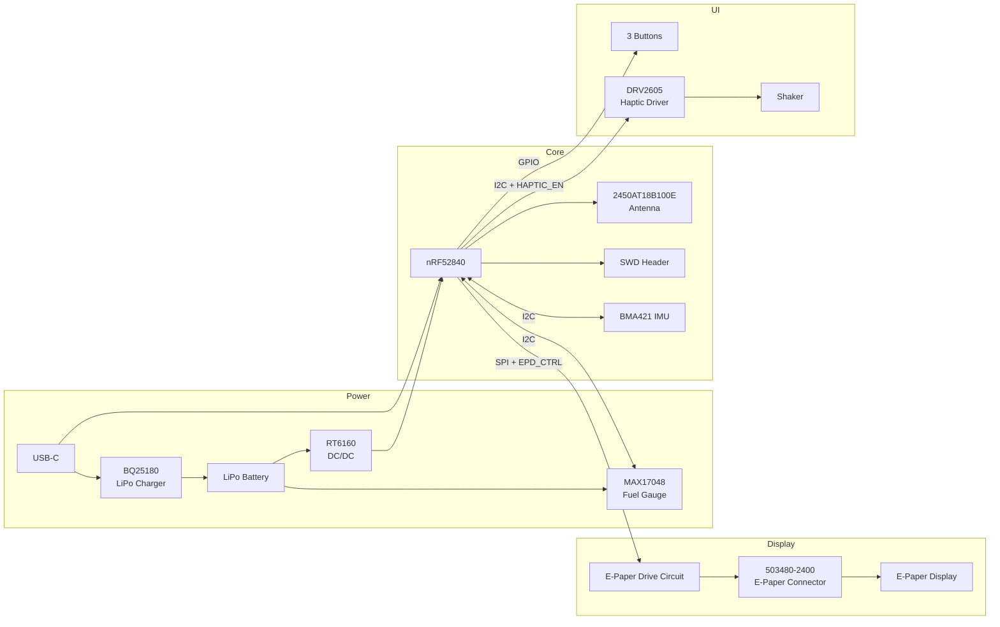

## Block Diagram
The system is built around the nRF52840 microcontroller, powered from a LiPo battery with USB-C charging, and integrates an e-paper display, IMU, fuel gauge, haptic driver, and three user buttons.

> If the block diagram does not render in your local Markdown viewer, open this file in VS Code and install the **Markdown Preview Mermaid Support** extension.

## Bill of Materials (BOM)

| Category | Designators | Value / Part | Package | Manufacturer | Manufacturer Part Number | Procurement (JLC Parts) | Datasheet |
|---|---|---:|---|---|---|---|---|
| MCU | U1 | nRF52840 | AQFN 7x7, 74 pins | Nordic Semiconductor | nRF52840 | TBD | TBD |
| LiPo Charger | IC1 | BQ25180YBGR | DSBGA-8 | Texas Instruments | BQ25180YBGR | TBD | TBD |
| IMU | IC3 | BMA421 | LGA | Bosch | BMA423 / BMA421 family | TBD | TBD |
| Haptic Driver | IC2 | DRV2605YZFR | DSBGA-9 | Texas Instruments | DRV2605YZFR | TBD | TBD |
| Fuel Gauge | U3 | MAX17048G+T10 | SON / WLP package | Analog Devices / Maxim | MAX17048G+T10 | TBD | TBD |
| DC/DC Converter | IC9 | RT6160AWSC | WL-CSP | Richtek | RT6160AWSC | TBD | TBD |
| Antenna | ANT1 | 2.45 GHz chip antenna | 3216 | Johanson Technology | 2450AT18B100E | TBD | TBD |
| USB-C Connector | J4 | USB Type-C receptacle | 16-pin SMD | Kinghelm | KH-TYPE-C-16P | TBD | TBD |
| ESD Protection | D3 | USB ESD array | SOT-23-6 | STMicroelectronics | USBLC6-2SC6Y | TBD | TBD |
| E-Paper Connector | J1 | FPC connector, 24-pin, 0.5 mm pitch | SMD | Molex | 503480-2400 | TBD | TBD |
| SWD Debug Header | J2 | SWD Tag-Connect header | IDC / Tag-Connect | Tag-Connect | TC2030-IDC | TBD | TBD |
| Haptic Motor |  | Coin vibration motor | 10 x 2.7 mm | DFRobot | FIT0774 / equivalent | TBD | TBD |
| User Buttons | SW_DN, SW_ENT, SW_UP | Tactile switch | SMD | Panasonic | EVP-AKE31A | TBD | TBD |
| MOSFET | Q3 | N-channel MOSFET | SC-70 | Vishay | SI1308EDL-T1-GE3 | TBD | TBD |
| MOSFET | Q1 | P-channel MOSFET | SOT-23-3 | TBD | TBD | TBD | TBD |
| Schottky Diodes | D2, D4, D5 | Schottky diode | SOD-123 | onsemi | MBR0530 | TBD | TBD |
| Inductor | L7 | FTC252012SR47MBCA | 2016 | TBD | FTC252012SR47MBCA | https://jlcpcb.com/partdetail/6763488-FTC252012SR47MBCA/C5832368 | TBD |
| Inductor | L1 | 3.9 nH | 2016 | Generic | Generic equivalent | TBD | TBD |
| Inductor | L2 | 10 uH | 2016 | Generic | Generic equivalent | TBD | TBD |
| Inductor | L3 | 15 nH | 2016 | Generic | Generic equivalent | TBD | TBD |
| Inductor | L5 | 68 uH | 0402 | Generic | Generic equivalent | TBD | TBD |
| Crystal | X1 | 32 MHz | 2016 | Generic | Generic equivalent | TBD | TBD |
| Crystal | X2 | 32.768 kHz | 3215 | Generic | Generic equivalent | TBD | TBD |
| Test Pads | TP_3.3V, TP_3V3, TP_BAT_GND, TP_GND, TP_ON, TP_OP, TP_RESET, TP_SCL, TP_SDA, TP_SWDCLK, TP_SWDIO, TP_SWO, TP_VBAT, TP_VREG | Test pad | TP20R | Custom | HECTOR_WATCH_1_TP20R | N/A | N/A |
| Jumper | SJ1 | Solder jumper | SMD | Generic | Generic equivalent | TBD | TBD |
| Resistors | R2, R3, R4 | 0 Ω | 0201 | Generic | Generic equivalent | TBD | TBD |
| Resistors | R1_EP_DR | 0.47 Ω | 0201 | Generic | Generic equivalent | TBD | TBD |
| Resistors | R2_EP_DR, R5, R7, R8, R9, R_PWR_EPD | 10 kΩ | 0201 | Generic | Generic equivalent | TBD | TBD |
| Resistors | R17, R18 | 3.3 kΩ | 0201 | Generic | Generic equivalent | TBD | TBD |
| Resistors | R1_USB, R2_USB | 5.1 kΩ | 0201 | Generic | Generic equivalent | TBD | TBD |
| Resistors | R_TYPE_SEL | 2.2 Ω | 0201 | Generic | Generic equivalent | TBD | TBD |
| Capacitors | C27, C34 | 0.1 uF | 0201 | Generic / Murata equivalent | Generic equivalent | TBD | TBD |
| Capacitors | C23, C42 | 0.1 uF | 0201 | Murata / equivalent | GRM011R60J152KE01L equivalent | TBD | TBD |
| Capacitors | EPD_C5 | 0.1 uF / 50V | 0201 | Generic | Generic equivalent | TBD | TBD |
| Capacitors | C5, C7, C8, C12, C19 | 100 nF | 0201 | Generic | Generic equivalent | TBD | TBD |
| Capacitors | C11 | 100 pF | 0201 | Generic | Generic equivalent | TBD | TBD |
| Capacitors | C1-EP-DR, C24, C39 | 10 uF | 0402 | Generic | Generic equivalent | TBD | TBD |
| Capacitors | C1, C2, C17, C18 | 12 pF | 0201 | Generic | Generic equivalent | TBD | TBD |
| Capacitors | C3, C4 | 1 pF | 0201 | Generic | Generic equivalent | TBD | TBD |
| Capacitors | C32 | 1 uF | 0201 | Generic / Murata equivalent | Generic equivalent | TBD | TBD |
| Capacitors | C29, C30, C31, C37, C38 | 1 uF | 0201 | Generic / Murata equivalent | Generic equivalent | TBD | TBD |
| Capacitors | C15 | 1 uF | 0402 | Generic | Generic equivalent | TBD | TBD |
| Capacitors | EPD_C1, EPD_C2, EPD_C6, EPD_C7, EPD_C8, EPD_C9, EPD_C10, EPD_C11, EPD_C12 | 1 uF / 50V | 0402 | Generic | Generic equivalent | TBD | TBD |
| Capacitors | C25, C33 | 22 uF | 0402 | Generic | Generic equivalent | TBD | TBD |
| Capacitors | C6, C14, C20, C21 | 4.7 uF | 0402 | Generic | Generic equivalent | TBD | TBD |
| Capacitors | C2-EP-DR | 4.7 uF / 25V | 0402 | Generic | Generic equivalent | TBD | TBD |
| Capacitors | C43 | 4.7 uF | 0402 | Generic | Generic equivalent | TBD | TBD |
| Capacitors | C16 | 47 nF | 0201 | Generic | Generic equivalent | TBD | TBD |
| Capacitors | C9 | 820 pF | 0201 | Generic | Generic equivalent | TBD | TBD |
| Capacitors | C10, C13 | N.C. | 0201 | N/A | N/A | N/A | N/A |
| Capacitors | C22 | N.C. | 0402 | N/A | N/A | N/A | N/A |
| Battery |  | LiPo 3.7 V 250 mAh | 502030 | AKYGA | LP502030 | TBD | TBD |
| Display |  | 1.54" e-Paper display | Module | Waveshare / GoodDisplay family | 1.54 inch e-Paper V2 | TBD | TBD |

## Hardware Functionality

The hardware platform is built around the **Nordic nRF52840** microcontroller, which acts as the central processing and communication unit of the device. The system integrates power-management circuitry, an inertial sensor, an e-paper display subsystem, a haptic feedback subsystem, USB connectivity, user input buttons, and a debug interface.

### Main hardware blocks

#### 1. Microcontroller – nRF52840
The nRF52840 is the core of the system. It was chosen because it provides:
- low-power operation, suitable for battery-powered wearable devices;
- a rich set of GPIOs;
- integrated USB device support;
- SPI and I2C peripherals for connecting multiple external components;
- SWD debug support;
- BLE capability for future wireless extensions.

The MCU is clocked using:
- a **32 MHz crystal** for the main system clock;
- a **32.768 kHz crystal** for accurate low-power timing.

It also includes the RF matching network and a **2.4 GHz chip antenna** for wireless communication.

---

#### 2. Power subsystem
The device is powered from a **single-cell LiPo battery** and charged through a **USB-C connector**.

The power architecture contains:
- **USB-C connector** for power input and USB communication;
- **USBLC6-2SC6Y** ESD protection for the USB data lines;
- **BQ25180YBGR** battery charger / PMIC for LiPo charging and battery power management;
- **RT6160AWSC** DC/DC converter for generating the regulated supply rail;
- decoupling capacitors and inductors used for filtering and rail stabilization;
- **MAX17048G+T10** fuel gauge for battery level monitoring.

This architecture allows the system to be powered both from USB and from battery, while also monitoring the battery state and keeping energy consumption low.

---

#### 3. E-paper display subsystem
The user interface is based on a **1.54-inch e-paper display**, connected through an FPC connector (**503480-2400**).  
Because the display requires dedicated bias voltages, the design also includes an **e-paper drive circuit** built from passive components, Schottky diodes, MOSFETs and filtering capacitors.

The display subsystem uses:
- **SPI signals** for communication with the MCU;
- several digital control signals:
  - `EPD_CS`
  - `EPD_DC`
  - `EPD_RST`
  - `EPD_BUSY`

The e-paper display was chosen because it has very low static power consumption and is well suited for wearable devices that only update the screen occasionally.

---

#### 4. IMU subsystem
Motion sensing is implemented using the **BMA421 IMU**.  
This sensor communicates with the MCU over **I2C** and provides interrupt outputs:
- `IMU_INT1`
- `IMU_INT2`

The IMU is used for motion/activity awareness and can wake or notify the MCU when specific events occur.

---

#### 5. Battery monitoring
Battery state measurement is handled by the **MAX17048 fuel gauge**, which communicates over **I2C** and provides an `ALERT` line to the MCU.  
This allows the firmware to estimate battery percentage and detect low-battery conditions.

---

#### 6. Haptic feedback
The haptic subsystem is built around the **DRV2605YZFR** haptic driver, connected to the MCU over **I2C**.  
The driver controls the vibration motor (shaker) through:
- `SDA`
- `SCL`
- `HAPTIC_EN`

This solution was chosen because it offloads waveform generation from the microcontroller and allows reliable control of the vibration motor.

---

#### 7. User buttons
The device includes **three buttons**:
- `SW_UP`
- `SW_ENT`
- `SW_DN`

These are connected to dedicated GPIO inputs of the MCU and provide the basic user interface for navigation and interaction.

---

#### 8. Debug and programming
For firmware upload and debugging, the board includes a **TC2030-IDC SWD header**.  
The exposed debug signals are:
- `SWDIO`
- `SWDCLK`
- `SWO`
- `RESET`
- `3.3V`
- `GND`

This header is used during development and testing.

---

## Interfaces used in the design

The design uses the following communication interfaces:

- **USB**
  - used for wired connectivity and battery charging path integration;
  - signals used: `VBUS`, `D+`, `D-`.

- **I2C**
  - shared bus used for:
    - BMA421 IMU
    - MAX17048 fuel gauge
    - DRV2605 haptic driver

- **SPI**
  - used for communication with the e-paper display subsystem

- **GPIO**
  - used for:
    - buttons
    - display control lines
    - interrupt lines
    - enable lines

- **SWD**
  - used for debugging and programming the nRF52840

---

## nRF52840 Pin Usage

Based on the schematic, the following nRF52840 pins are used for the main peripherals:

| nRF52840 Pin | Signal | Connected block | Purpose |
|---|---|---|---|
| P0.13 | D+ | USB-C | USB data line |
| P0.14 | D- | USB-C | USB data line |
| VBUS pin | VBUS | USB-C / charger | USB voltage detection |
| P0.06 | SDA | I2C bus | Shared data line for IMU, fuel gauge and haptic driver |
| P0.07 | SCL | I2C bus | Shared clock line for IMU, fuel gauge and haptic driver |
| P1.13 | MOSI | E-paper display | SPI data output to display |
| P1.15 | SCK | E-paper display | SPI clock |
| P0.17 | EPD_RST | E-paper display | Display reset |
| P0.15 | EPD_BUSY | E-paper display | Busy/status feedback from display |
| P0.16 | EPD_DC | E-paper display | Data/command select |
| P0.05 | EPD_CS | E-paper display | SPI chip select |
| P0.08 | IMU_INT1 | IMU | Interrupt from IMU |
| P1.08 | IMU_INT2 | IMU | Second interrupt from IMU |
| P0.11 | PMIC_INT | BQ25180 | Power-management interrupt |
| P0.24 | ALERT | MAX17048 | Battery fuel gauge alert |
| P0.12 | HAPTIC_EN | DRV2605 | Haptic driver enable/control |
| SWDIO | SWDIO | SWD header | Debug/programming |
| SWDCLK | SWDCLK | SWD header | Debug/programming |
| P0.18 / RESET | RESET | SWD header | Hardware reset |
| P1.09 | SWO | SWD header | Debug trace output |
| ANT pin | RF | Antenna matching network | 2.4 GHz RF connection |

### Why these pins were chosen
The chosen pin mapping follows the functional requirements of the peripherals:
- the dedicated **USB pins** of the nRF52840 are used for `D+` and `D-`;
- the e-paper display uses a mix of **SPI pins** and additional GPIO control lines;
- the sensors and monitoring ICs share the same **I2C bus**, which reduces routing complexity and saves GPIOs;
- interrupt-capable GPIOs are used for `IMU_INT1`, `IMU_INT2`, `PMIC_INT`, and `ALERT`;
- `SWDIO`, `SWDCLK`, `RESET`, and `SWO` are routed to the debug header for easier firmware development.

---

## Power Consumption Considerations

The board was designed with low-power operation in mind.

### Main power-saving choices
- **nRF52840** is a low-power MCU suitable for battery-powered applications.
- **E-paper display** only consumes significant power during refresh; static content does not require continuous display power like an LCD.
- **BQ25180** integrates battery charging and PMIC functionality, reducing the need for discrete always-on circuitry.
- **MAX17048** provides battery estimation with low overhead.
- **I2C shared bus** reduces pin count and simplifies routing.
- The **haptic motor** is driven only when needed.
- Buttons are connected as low-duty-cycle GPIO inputs.
- The external DC/DC stage improves efficiency compared to a purely linear power architecture.

### Qualitative consumption profile
The highest instantaneous consumption occurs during:
- battery charging over USB;
- e-paper refresh;
- vibration motor activation;
- radio activity of the nRF52840.

The lowest consumption mode is expected when:
- the display content is static,
- the MCU is in sleep mode,
- haptic feedback is off,
- no USB power is connected,
- only low-power monitoring remains active.

This makes the platform appropriate for a compact wearable device where energy efficiency matters more than continuous high-performance operation.

## ERC / Schematic Checks

During schematic verification, the project generated a small number of ERC warnings and one input-pin related message. These were reviewed manually before approval.

### Input-pin / single-pin style warnings
Warnings such as:
- `Only INPUT pins on net ...`
- `Only one pin on net ...`

were approved because, according to the project requirements and the lab guidance, these checks can be accepted when the designer has manually verified that the connections are intentional and that no required schematic connections are missing. In this design, the affected nets were inspected and no missing functional connection was identified.

### Power-pin warnings
Warnings of the form:
- `POWER pin ... connected to ...`

were also reviewed manually. After checking the schematic against the intended design, no missing supply rails or broken power connections were found. In addition, this was discussed during the lab, and we were told that such warnings can be approved when the power connectivity is intentional and complete.

## ERC Notes
Some ERC warnings were approved after manual verification. The `Only INPUT pins on net ...` and similar messages were accepted because the affected nets were intentionally connected and no functional connection was missing from the schematic. The power-pin warnings were also checked manually and approved after confirming that the supply rails and power connections were correct.

## DRC Notes
Some DRC warnings were approved in the PCB layout, mainly overlap-related messages such as SMD-via or pad-via overlaps. These were caused intentionally by using via-in-pad / escape routing in dense areas of the board, where this approach was necessary to complete routing in the available space.